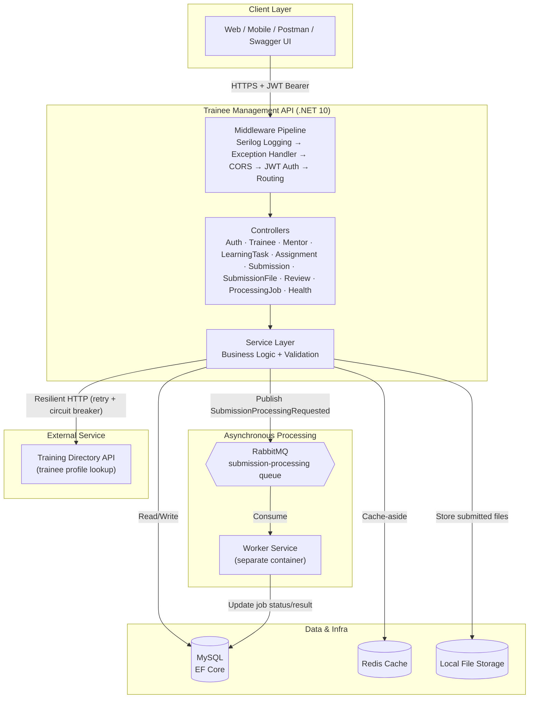
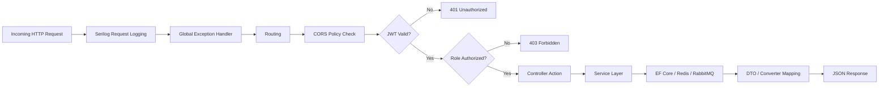
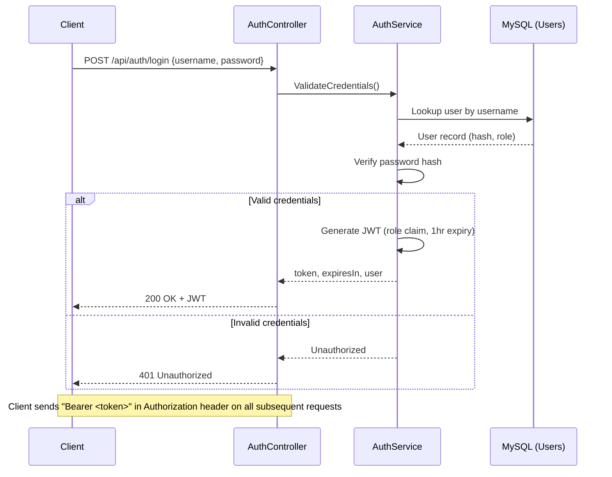
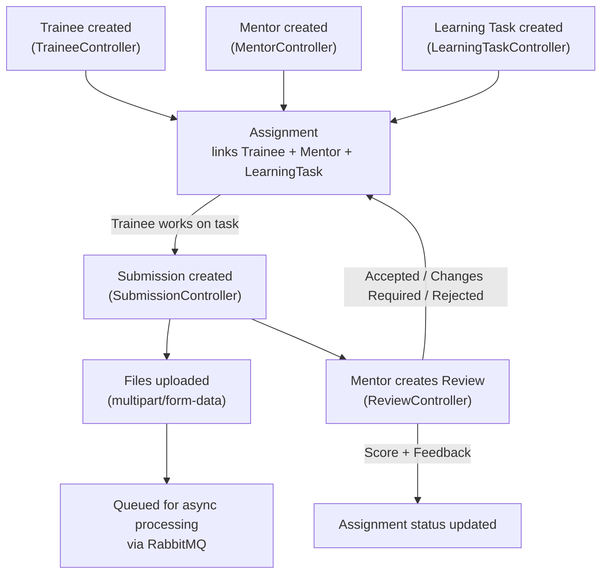
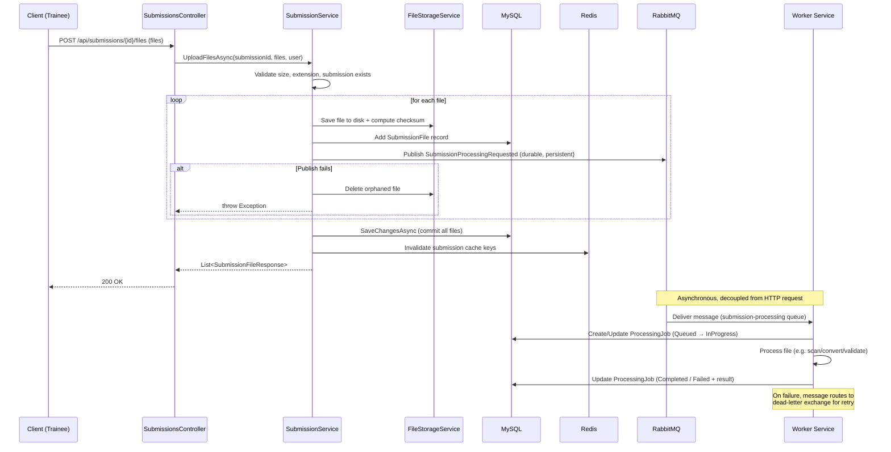
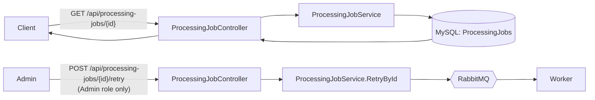
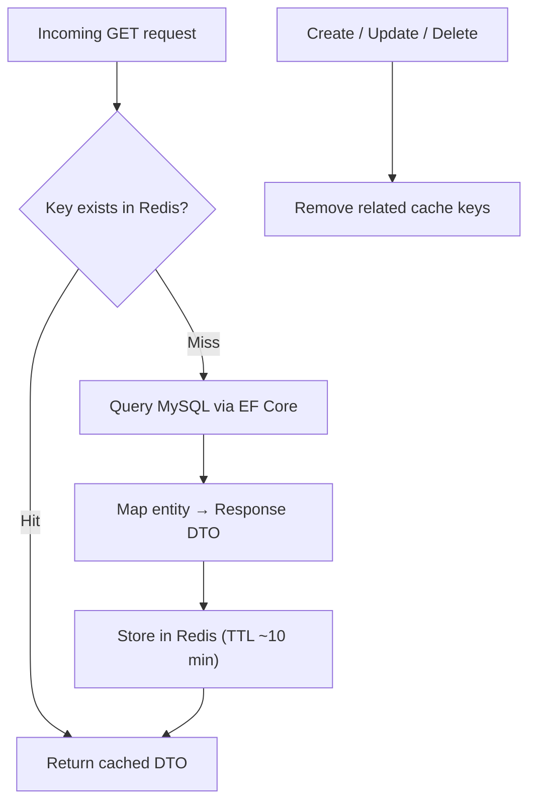
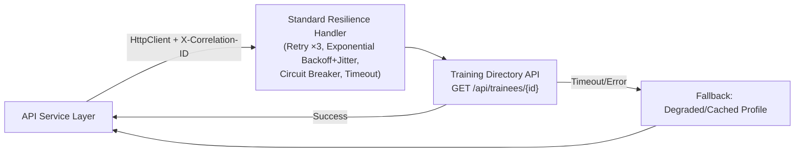
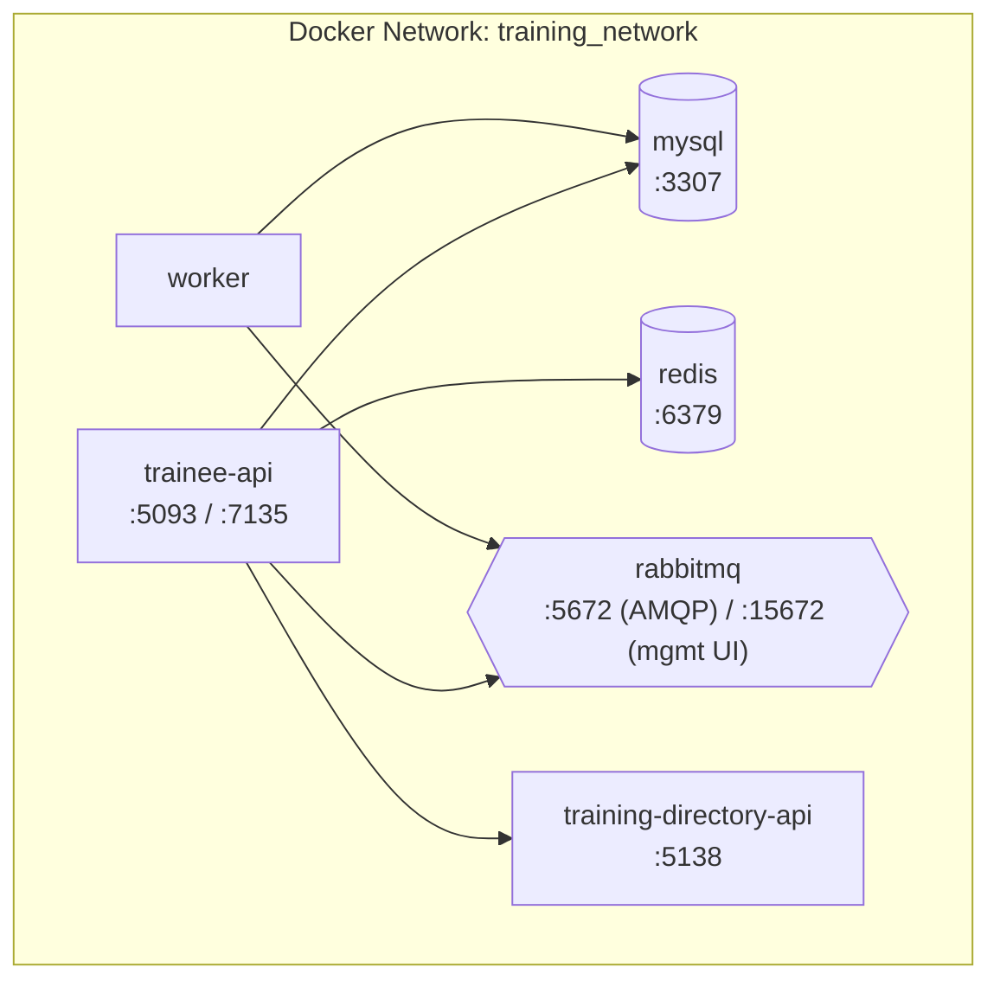
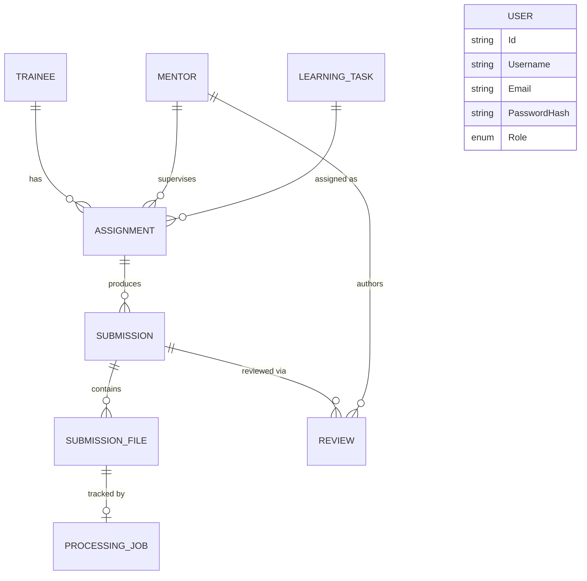

# Trainee Management API

A backend system for managing corporate/institutional trainee onboarding, mentor assignments, learning tasks, submissions, and reviews — built on **.NET 10 Web API**, with asynchronous file-processing powered by **RabbitMQ**, caching via **Redis**, persistence in **MySQL**, and integration with an external **Training Directory** microservice.

---

## 1. High-Level System Architecture



---

## 2. Request Lifecycle (Every API Call)



---

## 3. Authentication Flow



---

## 4. Core Domain Flow: Trainee → Assignment → Submission → Review



---

## 5. Submission File Upload & Async Processing Pipeline (Key Flow)



---

## 6. Processing Job Status & Retry



**Job status lifecycle:** `Queued → InProgress → Completed` (or `Failed`, retriable by an Admin).

---

## 7. Caching Strategy (Cache-Aside via Redis)



---

## 8. External Service Call (Resilience Pattern)



---

## 9. Deployment Topology (Docker Compose)



---

## 10. Entity Relationships



---

## Technology Stack

| Layer | Technology |
|---|---|
| Framework | .NET 10.0 Web API |
| Database | MySQL (EF Core) |
| Cache | Redis |
| Messaging | RabbitMQ (durable queue + dead-letter exchange) |
| Auth | JWT Bearer (Role-Based Access Control) |
| Logging | Serilog + custom file logger |
| Resilience | Polly-based standard resilience handler (retry, circuit breaker) |
| Containerization | Docker Compose (API, Worker, MySQL, Redis, RabbitMQ, Training Directory API) |

## Core Modules

- **Auth** — login, JWT issuance, RBAC (Admin / Mentor / Trainee)
- **Trainee / Mentor** — CRUD + search
- **Learning Task** — curriculum/task catalog
- **Assignment** — links a Trainee, Mentor, and Learning Task with due dates and status
- **Submission** — trainee work submissions tied to an Assignment
- **Submission File** — uploaded artifacts, validated, stored, and queued for async processing
- **Processing Job** — tracks async file-processing lifecycle, supports Admin-triggered retry
- **Review** — mentor feedback and scoring on a submission
- **Health** — liveness/readiness checks for MySQL, Redis, RabbitMQ, and the external Training Directory API

## How to Run

```bash
git clone https://github.com/deep-govindvira-zeus-learning/Trainee-Management-API
cd Trainee-Management-API
docker compose up --build
```

Or run the API standalone with `dotnet run` after configuring `appsettings.json` (MySQL connection string, Redis, RabbitMQ, JWT settings):

```bash
dotnet run
```

### MySQL setup steps

```bash
dotnet add package Pomelo.EntityFrameworkCore.MySql
dotnet add package Microsoft.EntityFrameworkCore.Design
```

Update the connection string with your local database configuration settings:
```json
{
  "ConnectionStrings": {
    "DefaultConnection": "Server=localhost;Port=3306;Database=trainee_management_db;Uid=YOUR_USERNAME;Pwd=YOUR_PASSWORD;"
  }
}
```

### EF Core migration commands

```bash
dotnet ef migrations add InitialCreate
dotnet ef database update
dotnet ef migrations script -o script/migration.sql
```

---

## Features Completed

1. Created an ASP.NET Web API project and successfully tested Swagger UI for API testing.
2. Created Health API.
3. Created Trainee Model.
4. Created in-memory Trainee list.
5. Created GET, POST, PUT, DELETE methods for trainee.
6. Created TraineeDTO, TraineeController, TraineeService, TraineeConverter.
7. Added validations on request.
8. Added AppDbContext and search API.
9. Moved from in-memory DB to a real MySQL database.
10. Created login API and implemented authorization (JWT + RBAC).
11. Added Mentor, Learning Task, and Assignment modules linking Trainee ↔ Mentor ↔ Learning Task.
12. Added Submission and Submission File modules with file upload, validation, and storage.
13. Integrated RabbitMQ for asynchronous submission-file processing with dead-letter retry support.
14. Added Processing Job tracking with Admin-triggered retry endpoint.
15. Added Review module for mentor feedback and scoring on submissions.
16. Added Redis distributed caching (cache-aside) for read-heavy endpoints.
17. Added resilient HTTP client (retry, exponential backoff, circuit breaker) for calling the external Training Directory API.
18. Added Serilog structured logging, a custom file logger, and a global exception handler.
19. Containerized the API, Worker, MySQL, Redis, and RabbitMQ via Docker Compose.

## Challenges Faced

- Faced challenges while creating the API; overcame them using the official .NET Core and C# documentation.
- Faced challenges while adding the service layer and updating the controllers to depend on it cleanly.
- Faced challenges while downloading a package due to AWS restrictions.
- Faced challenges coordinating reliable asynchronous processing — ensuring a file is only marked "queued" once it's both persisted in MySQL and successfully published to RabbitMQ, with cleanup of orphaned files on publish failure.
- Faced challenges configuring resilient inter-service communication (timeouts, retries, circuit breaker) so a slow/unavailable Training Directory API degrades gracefully instead of failing the whole request.
- Faced challenges with cache invalidation — making sure Redis entries are correctly cleared on every create/update/delete so stale data is never served.

## Api Endpoints

### Auth

| Method | Path | Description |
|---|---|---|
| POST | `/api/auth/login` | Authenticate a user and issue a JWT |

### Trainees

| Method | Path | Description |
|---|---|---|
| GET | `/api/trainees` | List trainees (supports `search` query param) |
| GET | `/api/trainees/{id}` | Get trainee by ID |
| POST | `/api/trainees` | Create a trainee |
| PUT | `/api/trainees/{id}` | Update a trainee |
| DELETE | `/api/trainees/{id}` | Delete a trainee |

### Trainee Profile

| Method | Path | Description |
|---|---|---|
| GET | `/api/trainee-profile/{id}` | Get an enriched trainee profile (calls external Training Directory API) |

### Mentors

| Method | Path | Description |
|---|---|---|
| GET | `/api/mentors` | List mentors |
| GET | `/api/mentors/{id}` | Get mentor by ID |
| POST | `/api/mentors` | Create a mentor |
| PUT | `/api/mentors/{id}` | Update a mentor |
| DELETE | `/api/mentors/{id}` | Delete a mentor |

### Learning Tasks

| Method | Path | Description |
|---|---|---|
| GET | `/api/learning-tasks` | List learning tasks |
| GET | `/api/learning-tasks/{id}` | Get learning task by ID |
| POST | `/api/learning-tasks` | Create a learning task |
| PUT | `/api/learning-tasks/{id}` | Update a learning task |
| DELETE | `/api/learning-tasks/{id}` | Delete a learning task |

### Assignments

| Method | Path | Description |
|---|---|---|
| GET | `/api/assignments` | List assignments |
| GET | `/api/assignments/{id}` | Get assignment by ID |
| POST | `/api/assignments` | Create an assignment (links Trainee, Mentor, Learning Task) |
| PATCH | `/api/assignments/{id}/status` | Update assignment status |

### Submissions

| Method | Path | Description |
|---|---|---|
| GET | `/api/submissions` | List submissions (Redis-cached) |
| GET | `/api/submissions/{id}` | Get submission by ID (Redis-cached) |
| POST | `/api/submissions` | Create a submission for an assignment |
| POST | `/api/submissions/{submissionId}/files` | Upload files for a submission (`multipart/form-data`); queues each file for async processing |

### Reviews

| Method | Path | Description |
|---|---|---|
| GET | `/api/reviews` | List reviews |
| GET | `/api/reviews/{id}` | Get review by ID |
| POST | `/api/reviews` | Create a mentor review (feedback + score) for a submission |

### Processing Jobs

| Method | Path | Description | Access |
|---|---|---|---|
| GET | `/api/processing-jobs/{id}` | Get processing job status/result | Authenticated |
| POST | `/api/processing-jobs/{id}/retry` | Re-queue a failed/stuck job | Admin only |

### Health

| Method | Path | Description |
|---|---|---|
| GET | `/api/health` | Aggregate health check (MySQL, Redis, RabbitMQ, Training Directory API) |

#### Example: Get All Trainees

**GET** `/api/trainees`

| Parameter | Type | Required | Description |
|---|---|---|---|
| `search` | string | No | Search across multiple Trainee fields (default: `""`) |

```json
[
  {
    "id": "23113761-3309-45ad-82ad-8d532b0877a2",
    "firstName": "Deep",
    "lastName": "Govindvira",
    "email": "deep.govindvira@zeuslearning.com",
    "techStack": "C#, .NET",
    "status": "Active",
    "createdDate": "2026-06-08T10:10:52.2837428Z",
    "updatedDate": "2026-06-08T10:10:52.2837871Z"
  }
]
```

#### Example: Login

**POST** `/api/auth/login`

```json
{
  "token": "eyJhbGciOiJIUzI1NiIsInR5cCI6IkpXVCJ9...",
  "expiresIn": 3600,
  "user": {
    "id": "4d5c4665-7fd1-48b3-a825-b78690b6189f",
    "username": "admin",
    "role": "Admin"
  }
}
```

## Login Credentials for Testing

The database automatically seeds default testing accounts during the initial migration application.

| Role | Username | Email | Password |
|---|---|---|---|
| Admin | admin | admin@test.com | Admin@123 |
| Trainee | trainee | trainee@test.com | Trainee@123 |
| Mentor | mentor | mentor@test.com | Mentor@123 |

## JWT Usage Instructions

This API secures endpoints using Role-Based Access Control (RBAC) via JWT Bearer authentication.

1. Send a `POST` request to `/api/auth/login` with valid test credentials.
2. Copy the `token` field from the response payload.
3. In your API client (Postman/Swagger UI), add a header:
   - Key: `Authorization`
   - Value: `Bearer <paste_your_token_here>`
4. The token expires in 1 hour.

## Limitations

- **Memory pagination:** large data sets are fetched into application memory before filtering.

## Security Checklist

- Change all default seed passwords before launching production instances.
- Configure strict CORS policies to block unauthorized domains.

## Next Improvement Areas

- Implement rate limiting on `/api/auth/login`.
